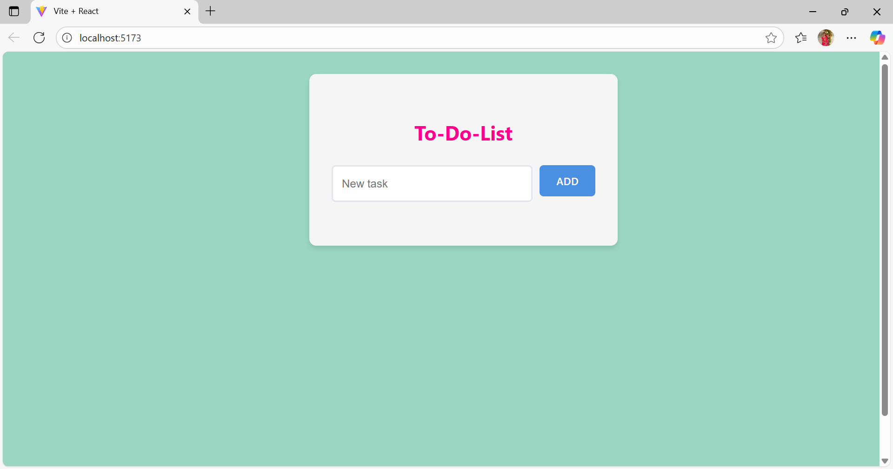
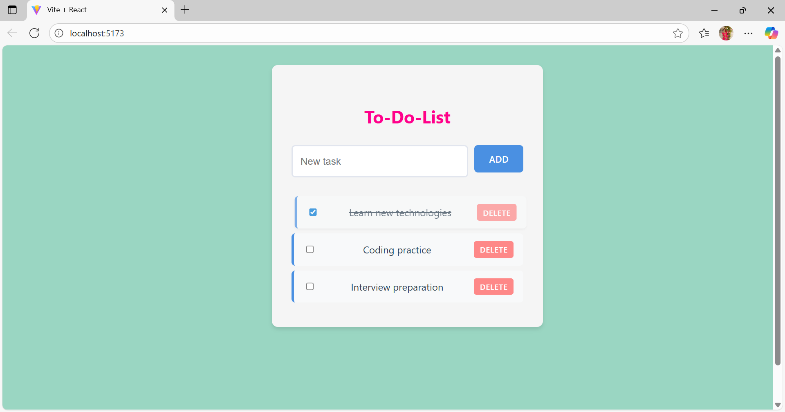

# 📝 React State Management - ToDo List

🚀 Continuing my React journey, I explored **state management** using hooks and built a simple yet effective **ToDo List App**.

This project helped me understand how to add, update, and delete tasks while managing component state efficiently.  

---

## ✨ Features
- ➕ Add new tasks  
- ✅ Mark tasks as completed  
- ❌ Delete tasks  
- 🎨 Simple and clean UI  

---

## ⚡ Tech Stack
- React (Hooks - useState) ⚛️  
- JavaScript (ES6+)  
- CSS3 for styling 🎨  

---

## 📸 Output Screenshots

### ➡️ Adding Tasks


### ➡️ Completed & Deleted Tasks


---

## 📂 Project Setup
1. Clone the repository  
   ```bash
   git clone https://github.com/tgmonisha/react_StateManagement.git
2. Install dependencies:
   
   npm install
4. Run the Project:
   
   npm run dev
   
<p align="center">  
  Made with ❤️ by <b>Monisha</b> ✨  
</p>
   
